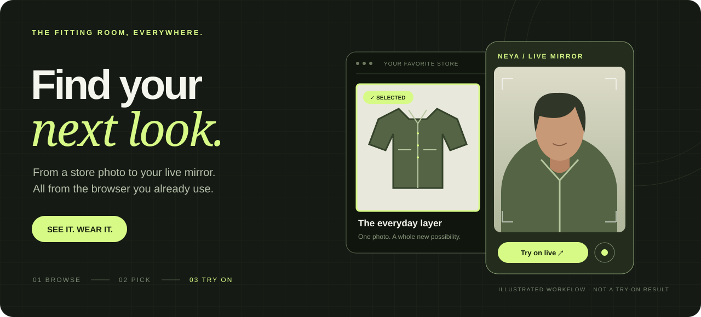
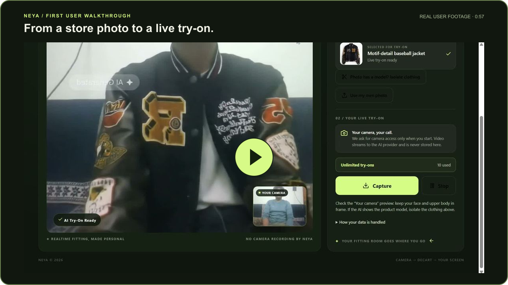

<p align="center">
  
</p>

<h1 align="center">Your browser. Your fitting room.</h1>

<p align="center">
  Find a look you love. Pick the photo. Try it on live.<br>
  Neya keeps the store in your browser and brings the fitting room to you.
</p>

<p align="center">
  <a href="https://github.com/MalyajNailwal/Neyaext/releases/latest/download/neya-extension.zip"><strong>Download Neya ↓</strong></a>
  &nbsp; · &nbsp;
  <a href="https://neya-eight.vercel.app">Open studio ↗</a>
  &nbsp; · &nbsp;
  <a href="PRIVACY.md">Privacy</a>
  &nbsp; · &nbsp;
  <a href="https://github.com/MalyajNailwal/Neyaext/issues">Get help</a>
</p>

<p align="center">
  <a href="https://github.com/MalyajNailwal/Neyaext/releases/latest"></a>
  <a href="LICENSE"></a>
  
</p>

<p align="center">
  
</p>

## Our first user, trying Neya

A real walkthrough shared by our first user: choosing a jacket on H&M, opening the Neya mirror, and seeing the live try-on. Thank you for taking Neya on its first shopping trip.

[](https://neya-eight.vercel.app/media/neya-first-user.mp4)

**[▶ Watch the real user walkthrough · 0:57](https://neya-eight.vercel.app/media/neya-first-user.mp4)** · [Watch on the website](https://neya-eight.vercel.app/#watch-demo)

This is user-submitted app footage, not an animated preview. The recording is presented with a Neya border and compressed for playback; the try-on result has not been retouched. Individual results vary. H&M is the store shown in the recording; no affiliation or endorsement is implied.

## Meet Neya

Neya is a browser extension for live AI clothing try-ons. Browse a clothing store, choose a garment photo, and open the live mirror to preview the look on your camera.

| Your next move | Neya makes it simple |
| --- | --- |
| **Find your next look** | Browse stores normally, or search from the side panel. |
| **Choose the right photo** | Detect product images automatically or use the image picker. |
| **See it on you** | Open a separate live mirror with camera permission. |
| **Keep exploring** | Choose another garment while your session is running. |
| **Save a moment** | Download a capture to your own device. |

AI previews are an approximation of appearance, not a measurement of size or fit. Image picking depends on how the store presents its photos.

## Install in a minute

**[Download the install ZIP →](https://github.com/MalyajNailwal/Neyaext/releases/latest/download/neya-extension.zip)**

1. **Extract the ZIP** into a permanent folder on your computer.
2. Open **`chrome://extensions`** or **`edge://extensions`**.
3. Turn on **Developer mode**, then click **Load unpacked**.
4. Select the extracted folder **that directly contains `manifest.json`**.
5. Pin **Neya**, open a clothing store, and choose **Open Browse & Try On** from its popup.

The folder you select should look like this:

```text
neya-extension/
├── manifest.json       ← this file must be directly inside the selected folder
├── background.js
├── content.js
├── popup.html
├── sidepanel.html
└── icons/
```

**“Manifest file is missing or unreadable”?** Open the extracted folder and locate `manifest.json`. Select that exact folder in **Load unpacked**—not the ZIP, Downloads, or an outer folder. The GitHub source download also works: extract it and select the `Neyaext-…` folder containing the manifest.

**Updating?** Replace the files inside your existing extension folder, click **Reload** on Neya's extension card, then refresh your shopping tabs. Keeping the same folder helps preserve an unpacked extension's identity.

## Your first try-on

**Browse → Pick → Open mirror → Go live**

1. Open a clothing product page and select its main photo.
2. Use **Change** in the side panel if you want another image. Hover to highlight, click to select, and press **Escape** to stop.
3. Click **Open live mirror & try on**, sign in, and enable your camera.
4. Keep shopping and choose another photo to switch the garment.
5. Use **Capture** to save a still, or **Stop** to end the session.

An account and available try-ons are required for the hosted studio. The camera permission belongs to the studio's mirror window. Settings in the extension popup let you change the Studio URL; the default is [neya-eight.vercel.app](https://neya-eight.vercel.app).

## Privacy, clearly

- Camera access starts when you begin a live try-on. Video is processed by Decart; Neya's server does not record the camera stream.
- Selected garment images are sent for try-on processing. Optional garment isolation also uses Decart.
- The studio stores account and usage information to handle sign-in and try-on limits.
- Captures download to your device.

Read the [full privacy policy](PRIVACY.md) for storage, providers, retention, and privacy requests.

<details>
<summary><strong>Troubleshooting</strong></summary>

| What you see | What to do |
| --- | --- |
| Manifest missing | Select the extracted folder with `manifest.json` directly inside it. Use the install ZIP linked above. |
| Change does not highlight images | Reload the extension, refresh the shopping tab, and choose a large clothing photo. Share the store URL in an issue if it persists. |
| Camera cannot start | Allow camera access for the studio, close other apps using the webcam, then retry. |
| Studio does not load | Check the Studio URL in popup settings and your network connection. |
| No try-ons remaining | Check your account's allowance in the studio. |

For a bug report, include your browser version, extension version, store URL, and the steps to reproduce it. Do not post tokens, passwords, camera images, or account details.

</details>

## Made by Malyaj

Built and maintained by **[Malyaj Nailwal](https://github.com/MalyajNailwal)**.

Neya explores a simple idea: bring the fitting room closer to the moment you discover something you want to wear.

[Report a bug](https://github.com/MalyajNailwal/Neyaext/issues/new) · [Suggest an improvement](https://github.com/MalyajNailwal/Neyaext/issues/new) · [Visit the studio](https://neya-eight.vercel.app)

## Extension source

This is the official public extension source and download repository. Its files are maintained through an automated one-way mirror. For changes, open an issue; source updates and releases are published by the maintainer.

The manifest and runtime files live at the repository root, so both the install ZIP and an extracted source download can be loaded unpacked. Release packaging verifies the manifest and required runtime files before publishing.

Licensed under **[Apache 2.0](LICENSE)**. Store imagery and third-party services retain their respective terms.

<p align="center"><sub>NEYA · SEE IT. WEAR IT.</sub></p>
